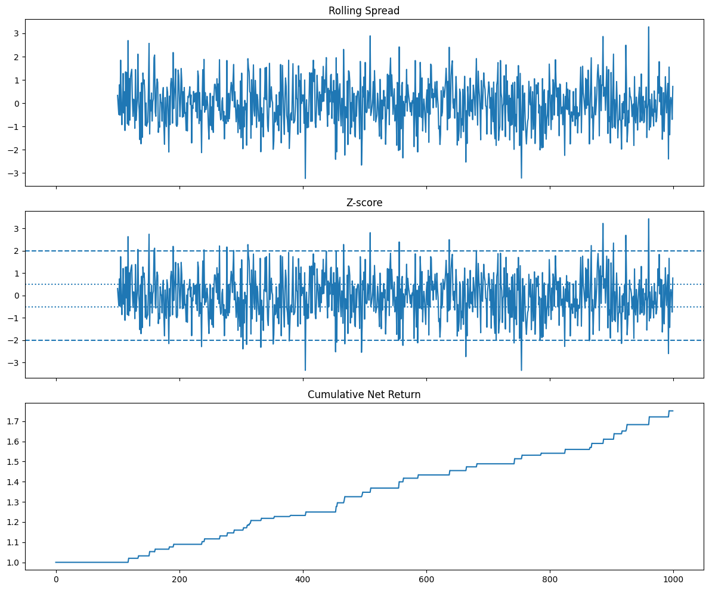

# Pairs-trading-setup-on-simulated-data
A compact Python project exploring a simple **cointegration-based pairs trading strategy** on simulated data.

The script simulates two cointegrated price series, estimates a **rolling hedge ratio** using OLS, constructs a spread, generates trading signals from the spread's **z-score**, and evaluates performance through a basic backtest with **lagged execution** and **transaction costs**.

## Overview

Pairs trading is a form of statistical arbitrage that seeks to profit from temporary deviations in the relationship between two related assets. This project implements a simple prototype of that idea using simulated data in order to focus on the mechanics of:

- cointegration testing
- spread construction
- rolling hedge ratio estimation
- z-score-based signal generation
- position sizing
- backtesting and performance evaluation

## Methodology

The strategy follows these steps:

1. Simulate two cointegrated price series.
2. Estimate the relationship between the series using a rolling OLS regression.
3. Construct the spread from the estimated hedge ratio.
4. Standardize the spread into a rolling z-score.
5. Enter trades when the z-score moves beyond a threshold and exit when it mean reverts.
6. Compute gross and net returns, including a simple turnover-based transaction cost model.

## Current Features

- Simulated cointegrated asset prices
- Engle-Granger-style regression framework
- Rolling hedge ratio estimation
- Spread and z-score calculation
- Long/short signal generation
- Dollar-normalized position sizing
- Transaction-cost-aware backtest
- Performance summary:
  - annualized return
  - annualized volatility
  - Sharpe ratio
  - maximum drawdown
  - trade count
- Basic strategy plots:
  - spread
  - z-score
  - cumulative return

## Example Output

The script produces:
- a plot of the simulated price series
- residual diagnostics from the initial regression
- backtest summary statistics
- plots of the spread, z-score, and cumulative strategy return

## Motivation

This repository was built as a small portfolio project to demonstrate core concepts in:

- quantitative trading
- financial time series analysis
- statistical arbitrage
- Python-based backtesting

## Limitations

This is a simplified research prototype rather than a production-grade trading system. In particular:

- the strategy is tested on simulated rather than real market data; the simulated data has very ideal characteristics
- there is no train/validation/test split yet
- pair selection is not yet extended to a larger stock universe
- transaction cost modeling is simplified

## Possible Extensions

Natural next steps include:

- testing on real equity data
- adding train/validation/test splits
- screening for cointegrated pairs across a larger universe
- comparing static vs rolling hedge ratios
- improving execution and cost assumptions
- adding parameter sensitivity analysis

## Python Libraries Used

- NumPy
- pandas
- statsmodels
- Matplotlib
